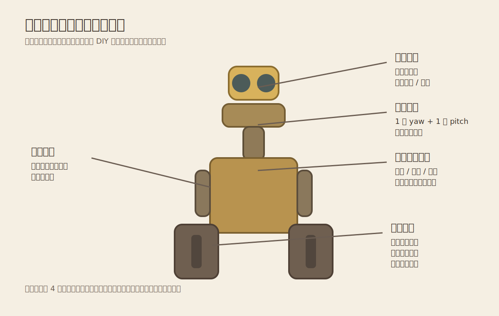

# 机械与建模方案

## 1. 建模策略

建议采用 `外观优先 + 结构反推` 的方法：

1. 先建立整体比例模型
2. 再定义内部安装空间
3. 最后拆件出图和打印

对于瓦力这类角色机器人，外观神韵来自：

- 双目头部比例
- 眼睛外框形状
- 脖颈高度与姿态
- 履带箱体的厚度与倾角
- 胸腔前面板与旧工业设备质感

## 2. 软件建议

- `Fusion 360`：结构设计、装配关系、开孔、支架、参数化最好
- `Blender`：外观雕刻、旧化细节、渲染展示
- `Unity`：动作预演、状态机验证、交互原型

## 3. 模块拆分

建议拆成 7 个大模块：

- 头部外壳
- 眼睛机构
- 脖颈云台
- 躯干外壳
- 左右手臂
- 履带底盘
- 电控与电池舱

## 4. 头部机构建议

### 推荐结构

- 左右转：单独一套旋转平台
- 俯仰：头部与眼睛总成安装在俯仰支架上
- 眼睛显示：小圆屏、方屏裁切，或灯板假发光

### 设计重点

- 头部尽量轻
- 电线要预留过线空间
- 限位角度不能让线束被扭断

## 5. 履带底盘建议

### 结构路线

- 方案 1：现成履带底盘改造
- 方案 2：自研轮组 + 履带

第一次 DIY 推荐先用现成履带底盘的轮组思想，再外包外壳。

### 底盘设计要点

- 电机位置尽量靠下
- 电池尽量放低放中
- 左右重心对称
- 履带张紧结构可调

## 6. 材料建议

### 外壳

- PLA：打样快，但耐热一般
- PETG：更适合正式件
- ABS/ASA：需要更高打印经验

### 骨架

- 2020 铝型材
- 铝板折弯件
- 亚克力板
- 碳纤维板

第一版推荐：`3D 打印外壳 + 铝/亚克力骨架`

## 7. 尺寸建议

第一次做建议控制在：

- 总高：`500 mm - 800 mm`
- 总重：`8 kg - 18 kg`

原因：

- 太小会挤压内部空间
- 太大则对扭矩、打印尺寸、运输、重心要求暴涨

## 8. 建模流程

### 阶段 1：比例模型

- 根据参考图建立正视/侧视轮廓
- 做出头、躯干、履带的大体积块

### 阶段 2：结构模型

- 给每个模块定义内部安装空间
- 确定电机、舵机、电池、主控板位置
- 检查线束通道和维修空间

### 阶段 3：工程拆件

- 拆分打印件
- 增加螺丝柱、定位销、卡扣
- 设置法兰、轴承座、支撑筋

### 阶段 4：表面细节

- 做旧、划痕、铆钉、焊缝、工业铭牌
- 这些细节最好后期喷涂时实现，不必全部建模

## 9. 你可以先做的建模 MVP

- 头部总成
- 脖颈双自由度结构
- 底盘外轮廓
- 电池与主板安装位

这四项一旦通了，项目就从“想法”变成“可造”。

## 10. 图解建议

看上面的机械图时，优先注意这几个点：

- 头部总成一定要轻，不然俯仰轴会非常痛苦
- 脖颈结构是全机最容易返工的地方，要先冻结行程和走线
- 底盘内部空间比外观想象中更紧，电池和驱动器最好先摆进去
- 手臂先做“有姿态”而不是“有复杂功能”，展示收益更高
