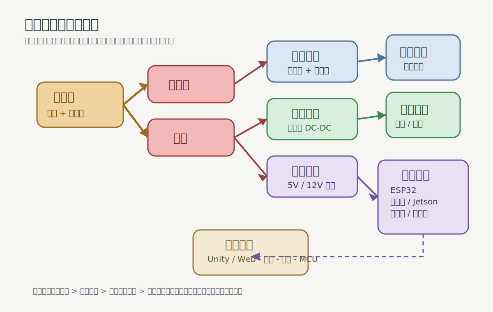

# 电气与控制系统

## 1. 控制分层

### 底层 MCU 负责

- 电机 PWM
- 舵机控制
- 编码器采样
- 急停
- 电池电压上报
- 低级保护逻辑

### 高层计算板负责

- 视觉识别
- 语音处理
- 动作编排
- Web/Unity/ROS2 接口
- 日志与调试

## 2. 供电架构

推荐至少分三路：

- `动力电源`：给履带电机
- `舵机电源`：给高峰值姿态执行器
- `逻辑电源`：给 ESP32、树莓派、Jetson、传感器

共地，但不要混用同一条细线串联供电。

## 3. 电气保护

- 主电源总开关
- 急停按钮
- 支路保险丝
- 反接保护
- DC-DC 输入输出滤波
- 关键板卡独立散热

## 4. 控制信号建议

### 电机控制

- PWM + DIR
- 编码器闭环测速
- 左右履带独立控制

### 舵机控制

- 独立 PWM 通道
- 启动时做姿态回零
- 软件限位 + 机械限位双保险

## 5. 串口协议建议

建议先做一个非常简单的协议：

- `CMD_MOVE v_left v_right`
- `CMD_HEAD yaw pitch`
- `CMD_ARM left right`
- `CMD_MODE idle/demo/manual/auto`
- `CMD_STOP`

反馈报文：

- `STATE battery`
- `STATE imu`
- `STATE encoder`
- `STATE distance`
- `STATE fault`

## 6. 状态机建议

### 主状态

- `BOOT`
- `IDLE`
- `MANUAL`
- `DEMO`
- `AUTO`
- `FAULT`

### 状态切换原则

- 任意状态收到急停即进入 `FAULT`
- 故障复位后才能回到 `IDLE`
- 自动模式任何时刻允许人工接管

## 7. 必做保护逻辑

- 电压过低报警
- 电机过流或过温保护
- 串口心跳丢失时停车
- 启动时所有关节缓启动
- 机械碰撞时立刻停止动作脚本

## 8. 接线经验

- 动力线与信号线尽量分开走
- 舵机电源线要考虑压降
- 每个模块用可维护插头，方便拆装
- 线束编号，否则后期维护很痛苦

## 9. 图解说明

- 红色链路代表高优先级的断电与急停路径
- 三个支路分别对应动力、舵机、逻辑，避免互相污染
- 逻辑设备从高层到 MCU 再到底盘，是最稳的调试路线
