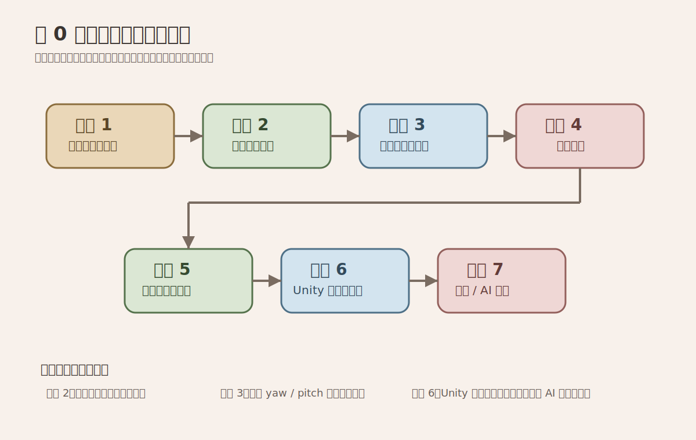

# 组装流程

## 1. 推荐装配顺序

1. 先装底盘，不装外壳
2. 调通履带运动
3. 再装头部和脖颈
4. 调通头部自由度
5. 再装躯干与手臂
6. 最后整理线束、封外壳、做喷涂

## 2. 底盘阶段

### 目标

- 平稳直行
- 原地转向
- 不掉链
- 重心稳定

### 检查项

- 履带松紧是否合适
- 左右电机转速是否匹配
- 地面摩擦是否过大
- 电池固定是否牢靠

## 3. 头部阶段

### 目标

- 左右转顺滑
- 俯仰不抖
- 线束不会被拉扯

### 检查项

- 头部重心是否偏前
- 舵机安装座是否刚性不足
- 运动到极限时是否撞壳

## 4. 电控阶段

### 目标

- 通电稳定
- 无明显压降复位
- 急停有效

### 检查项

- 空载电流
- 负载电流
- 电源发热
- DC-DC 输出波动

## 5. 外壳与喷涂阶段

### 工艺建议

- 打磨
- 补土
- 底漆
- 主色
- 做旧
- 消光保护

如果你追求“展陈感”，喷涂质感的影响往往比多一个传感器更大。

## 6. 最终装配阶段

- 固定所有线束
- 添加防松措施
- 贴标识与铭牌
- 设置检修口
- 记录每个模块拆装步骤

## 7. 常见问题

### 机器人晃动

- 重心过高
- 履带左右摩擦差异大
- 启停加速度太猛

### 头部抖动

- 舵机扭矩不够
- 结构刚性不足
- 重心偏置过大
- PWM 更新策略不稳定

### 通电重启

- 舵机瞬时电流拉低逻辑电压
- 地线布置不合理
- 降压模块功率不足

## 8. 看图执行建议

- 不要跳过“底盘验证样机”直接进入正式喷涂
- 头部机构联调通过前，不要把外壳完全封死
- Unity 开发台建议在总装前就接入，这样每个阶段都能复用
