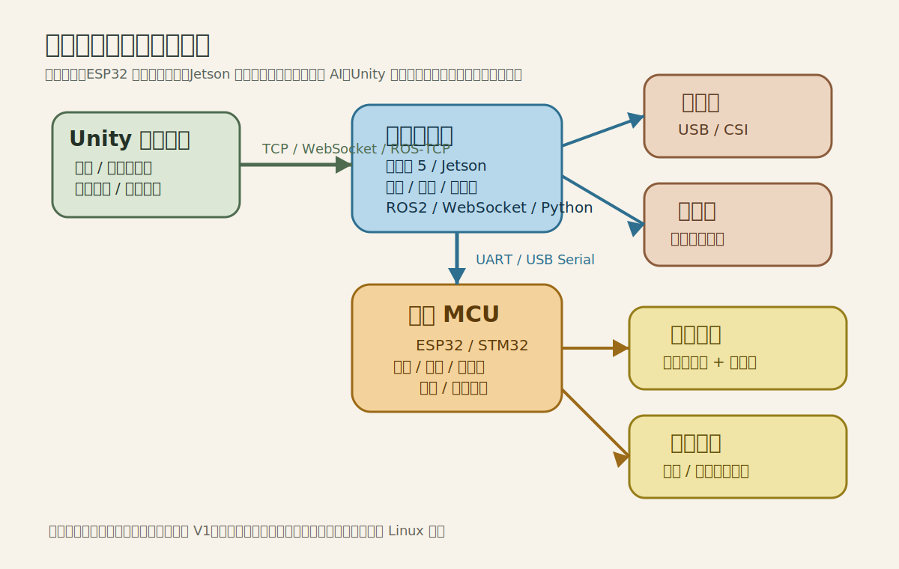
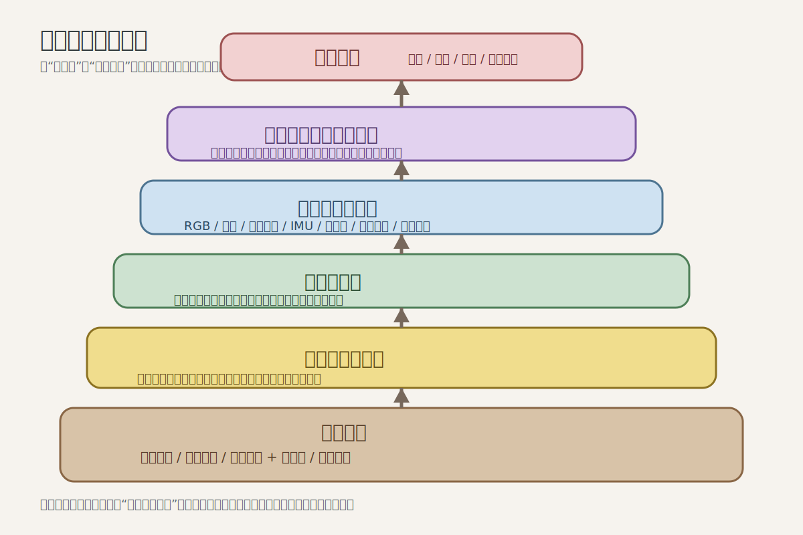

# 软件架构与 Unity 路线

## 1. 为什么 Unity 是你的强项

你可以把这个项目做成“先有任务代理和数字孪生，再映射到实体机器人”的开发流程：

- Unity 做数字样机
- Unity 做动作预演
- Unity 做导航状态可视化
- Unity 做任务代理调试台
- 最后再把接口接到真实硬件

这会大幅降低纯硬件试错成本。

但这里有一个重要边界：

- `Unity 非常适合做主力开发平台`
- `Unity 不适合默认承担 Jetson/树莓派 ARM Linux 上的机载主运行时`

也就是说，建议你把 Unity 当成“主开发台”和“仿真可视化前端”，而不是强行把它塞进机器人机载 ARM Linux 主程序里。

## 2. 软件总体架构

### 层 1：实体底层控制

- ESP32 固件
- 负责电机、舵机、传感器读取

### 层 2：机器人服务层

- Python / C# / Node.js
- 负责串口通信、动作脚本、日志、WebSocket 服务
- 负责调用 OpenAI API
- 负责工具调用编排
- 推荐以 Docker 容器形式部署在 Jetson 或其他 Linux 机载计算平台上

### 层 3：Unity 上位机

- 任务输入界面
- 状态监控
- 参数调节
- 数字孪生展示
- 地图回放与任务调试

### 层 4：AI/ROS2 扩展层

- 视觉检测
- 语音处理
- 状态规划
- Isaac Sim / ROS2 接入
- 任务代理与工具调用

## 3. Unity 推荐拆分

### 模块 A：数字孪生机器人

- 与实体相同骨架节点
- 同样的自由度命名
- 接收实时状态并驱动模型

### 模块 B：控制台

- 任务输入面板
- 语音状态面板
- 地图与目标点位
- 参数调节面板
- 实时日志

### 模块 C：动作编辑器

- 定义头部角度关键帧
- 定义手臂动作
- 与音效同步

## 4. 通讯路线

### 最简单路线

- Unity <-> Python 服务：WebSocket/TCP
- Python 服务 <-> ROS2 / 导航服务
- ROS2 / 高层 <-> ESP32：串口

### ROS2 路线

- Jetson/树莓派 跑 ROS2
- Unity 使用 ROS-TCP Connector
- Topic 中同步姿态、传感器、命令
- 独立代理服务通过 API 调用 OpenAI

### Docker 路线

- `robot-core`：ROS2、导航、感知
- `robot-agent`：OpenAI API、任务规划、工具调用
- `robot-voice`：STT / TTS / 音频流
- `robot-memory`：地点语义、任务历史、偏好

## 5. 推荐数据结构

### Unity 发命令

- 任务文本
- 语义地点
- 模式切换
- 人工确认/拒绝
- 调试参数

### 机器人回传

- 电池电压
- 履带速度
- IMU 姿态
- 距离传感器
- 当前状态机状态
- 错误码
- 当前任务
- 当前导航目标
- LLM 推理结果摘要

## 6. 动作系统建议

不要一开始做复杂动画树，先做：

- `Pose`：瞬时目标姿态
- `Sequence`：若干 Pose 按时间串起来
- `DemoScript`：Sequence + 音效 + 灯光联动

这样最适合实体机器人。

## 7. 如果接入 Jetson

你可以采用以下分工：

- Jetson：视觉、定位、Nav2、ROS2、中控逻辑
- ESP32：低层驱动
- Unity：主力开发、可视化、调参、演示

这会非常接近“英伟达风格 AI 机器人”的技术表达方式。

## 8. 大模型代理建议

推荐的工具集：

- `get_robot_state()`
- `get_map_locations()`
- `navigate_to(location_id)`
- `cancel_navigation()`
- `speak(text)`
- `set_expression(mode)`
- `request_human_help(reason)`

推荐的策略：

- LLM 只产出结构化任务，不直接输出电机控制量
- 任何物理移动任务都必须经过导航层确认
- 当目标不可达时，要优先解释原因而不是“乱试”

## 9. 你现在就能开始的软件工作

1. 在 Unity 中搭一个简化版瓦力骨架
2. 做一个任务控制面板，而不是遥控面板
3. 定义 `RobotState`、`RobotCommand`、`RobotTask` 数据结构
4. 用假数据跑通数字孪生
5. 再把假数据换成 ROS2 / 串口 / API 真数据

## 10. 图解理解方式

- Unity 在左侧，代表你的主工作台
- 高层计算板在中间，负责把“任务逻辑”变成“机器人行为”
- MCU 在下面，负责把“行为”变成“稳定动作”
